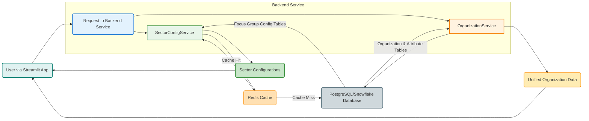

id: 695fd6df0bbab4f5f08b76de_documentation
summary: Data Layer & Caching Documentation
feedback link: https://docs.google.com/forms/d/e/1FAIpQLSfWkOK-in_bMMoHSZfcIvAeO58PAH9wrDqcxnJABHaxiDqhSA/viewform?usp=sf_link
environments: Web
status: Published
# QuLab: Unified Data Architecture & Caching for PE Intelligence

## 1. Setting the Stage: Context and Key Concepts
Duration: 0:05
Welcome to the QuLab! In this codelab, we'll dive deep into building a robust and flexible data architecture for a Private Equity (PE) Intelligence Platform. This platform aims to provide insights into various PE sectors, each with its unique characteristics and data requirements.

The primary challenge in such a system is managing the diversity of sectors without falling into the trap of "schema proliferation," where each sector gets its own set of tables, leading to complex and unmanageable database designs.

<aside class="positive">
<b>Configuration-driven architecture</b> is a powerful paradigm where the differences between entities (like our PE sectors) are defined by data stored in configuration tables, rather than by variations in the database schema itself.
</aside>

**Key Objectives of this Lab:**
*   **Understand** the "One Schema, Many Configurations" principle.
*   **Design** a flexible and extensible database schema that supports sector-specific attributes.
*   **Implement** an efficient service for loading sector configurations, complete with caching.
*   **Create** a unified data view that combines core organizational data with dynamic, sector-specific attributes.

**Tools and Technologies:**
Throughout this lab, we'll be discussing concepts often implemented with:
*   **PostgreSQL / Snowflake**: Our primary relational database, chosen for its flexibility and robust feature set.
*   **SQLAlchemy 2.0**: An Object-Relational Mapper (ORM) for Python, simplifying database interactions.
*   **Alembic**: A database migration tool, used to manage schema changes in a version-controlled manner.
*   **Redis**: An in-memory data structure store, essential for implementing a high-performance caching layer.
*   **Streamlit**: The framework used to build this interactive codelab application.

**Key Concepts Introduced:**
*   **One Schema, Many Configurations**: The central theme. Instead of separate schemas for each PE sector, we use a single base schema where sector differentiation is achieved through data rows in configuration tables.
*   **Focus Group Configuration Tables**: These tables store weights, calibrations, and other parameters that define the unique characteristics of each PE sector.
*   **Queryable Sector Attribute Tables**: Rather than using less flexible `JSONB` columns or wide tables with many nullable columns, we design dedicated, strongly-typed tables for sector-specific attributes.
*   **Configuration Caching**: Utilizing Redis to store frequently accessed configurations in memory, drastically reducing database load and improving response times.

This architectural approach allows our platform to be highly adaptable and scalable, easily accommodating new sectors or changes to existing sector configurations with minimal impact on the underlying data model.

### Overall Architecture Flow
The following diagram illustrates the high-level architecture discussed in this codelab:


## 2. Designing for Flexibility: The Configuration-Driven Schema
Duration: 0:15
In this section, we lay the foundation of our data layer by designing a schema that embodies the "One Schema, Many Configurations" principle. This approach is paramount for building an extensible PE intelligence platform without succumbing to schema bloat as new sectors or attributes are introduced.

<aside class="positive">
Using a configuration-driven schema with dedicated attribute tables has several advantages:
<ul>
    <li><b>No Schema Proliferation</b>: All sectors share the same core table structures.</li>
    <li><b>Minimized NULLs</b>: Sector-specific attributes only exist where relevant, reducing `NULL` values in central tables.</li>
    <li><b>Strongly Typed & Queryable</b>: Attributes are stored in their native data types, making them highly efficient for querying and indexing, unlike `JSONB` columns which can be less performant for complex queries.</li>
    <li><b>Reduced N×M Joins</b>: Centralizing configuration data reduces the need for complex many-to-many join patterns.</li>
</ul>
</aside>

### Task 2.1: Design the Focus Group Configuration Schema
We begin by defining the core tables that hold our sector definitions and their associated configurations:
*   `focus_groups`: Defines the PE sectors themselves.
*   `dimensions`: Lists the various AI/data dimensions relevant for scoring.
*   `focus_group_dimension_weights`: Stores the relative importance (weights) of each dimension *per sector*.
*   `focus_group_calibrations`: Holds various numeric or categorical parameters unique *to each sector*.

Here's the PostgreSQL DDL for these tables:

```sql
CREATE TABLE focus_groups (
    focus_group_id VARCHAR(50) PRIMARY KEY,
    platform VARCHAR(20) NOT NULL CHECK (platform IN ('pe_org_air', 'individual_air')),
    group_name VARCHAR(100) NOT NULL,
    group_code VARCHAR(30) NOT NULL,
    group_description TEXT,
    display_order INTEGER NOT NULL,
    icon_name VARCHAR(50),
    color_hex VARCHAR(7),
    is_active BOOLEAN DEFAULT TRUE,
    created_at TIMESTAMP DEFAULT CURRENT_TIMESTAMP,
    updated_at TIMESTAMP DEFAULT CURRENT_TIMESTAMP,
    UNIQUE (platform, group_code)
);

CREATE TABLE dimensions (
    dimension_id VARCHAR(50) PRIMARY KEY,
    platform VARCHAR(20) NOT NULL,
    dimension_name VARCHAR(100) NOT NULL,
    dimension_code VARCHAR(50) NOT NULL,
    description TEXT,
    min_score DECIMAL(5,2) DEFAULT 0,
    max_score DECIMAL(5,2) DEFAULT 100,
    display_order INTEGER NOT NULL,
    created_at TIMESTAMP DEFAULT CURRENT_TIMESTAMP,
    UNIQUE (platform, dimension_code)
);

CREATE TABLE focus_group_dimension_weights (
    weight_id SERIAL PRIMARY KEY,
    focus_group_id VARCHAR(50) NOT NULL REFERENCES focus_groups(focus_group_id),
    dimension_id VARCHAR(50) NOT NULL REFERENCES dimensions(dimension_id),
    weight DECIMAL(4,3) NOT NULL CHECK (weight >= 0 AND weight <= 1),
    weight_rationale TEXT,
    effective_from DATE NOT NULL DEFAULT CURRENT_DATE,
    effective_to DATE,
    is_current BOOLEAN DEFAULT TRUE,
    created_at TIMESTAMP DEFAULT CURRENT_TIMESTAMP,
    UNIQUE (focus_group_id, dimension_id, effective_from)
);

CREATE TABLE focus_group_calibrations (
    calibration_id SERIAL PRIMARY KEY,
    focus_group_id VARCHAR(50) NOT NULL REFERENCES focus_groups(focus_group_id),
    parameter_name VARCHAR(100) NOT NULL,
    parameter_value DECIMAL(10,4) NOT NULL,
    parameter_type VARCHAR(20) DEFAULT 'numeric',
    description TEXT,
    effective_from DATE NOT NULL DEFAULT CURRENT_DATE,
    effective_to DATE,
    is_current BOOLEAN DEFAULT TRUE,
    created_at TIMESTAMP DEFAULT CURRENT_TIMESTAMP,
    UNIQUE (focus_group_id, parameter_name, effective_from)
);
```

### Task 2.4: Design the Organizations Table with Sector Reference
The `organizations` table is central, storing core information about each company. Its crucial link to the configuration-driven architecture is the `focus_group_id` foreign key, directly connecting each organization to its primary PE sector.

```sql
CREATE TABLE organizations (
    organization_id UUID PRIMARY KEY DEFAULT gen_random_uuid(),
    legal_name VARCHAR(255) NOT NULL,
    display_name VARCHAR(255),
    ticker_symbol VARCHAR(10),
    cik_number VARCHAR(20),
    duns_number VARCHAR(20),
    focus_group_id VARCHAR(50) NOT NULL REFERENCES focus_groups(focus_group_id),
    primary_sic_code VARCHAR(10),
    primary_naics_code VARCHAR(10),
    employee_count INTEGER,
    annual_revenue_usd DECIMAL(15,2),
    founding_year INTEGER,
    headquarters_country VARCHAR(3),
    headquarters_state VARCHAR(50),
    headquarters_city VARCHAR(100),
    website_url VARCHAR(500),
    status VARCHAR(20) DEFAULT 'active' CHECK (status IN ('active', 'inactive', 'archived')),
    created_at TIMESTAMP DEFAULT CURRENT_TIMESTAMP,
    updated_at TIMESTAMP DEFAULT CURRENT_TIMESTAMP,
    created_by VARCHAR(100),
    CONSTRAINT chk_org_pe_platform CHECK (focus_group_id LIKE 'pe_%')
);
```

### Task 2.5: Design the Sector-Specific Attribute Tables
To avoid large, sparse tables or the complexities of `JSONB` for queryable attributes, we create separate, strongly-typed attribute tables for each specific PE sector. Each table has `organization_id` as its primary key and foreign key, ensuring a one-to-one relationship with the `organizations` table.

For example, here are DDLs for Manufacturing and Financial Services attributes:

```sql
CREATE TABLE org_attributes_manufacturing (
    organization_id UUID PRIMARY KEY REFERENCES organizations(organization_id),
    ot_systems VARCHAR(100)[],
    it_ot_integration VARCHAR(20),
    scada_vendor VARCHAR(100),
    mes_system VARCHAR(100),
    plant_count INTEGER,
    automation_level VARCHAR(20),
    iot_platforms VARCHAR(100)[],
    digital_twin_status VARCHAR(20),
    edge_computing BOOLEAN DEFAULT FALSE,
    supply_chain_visibility VARCHAR(20),
    demand_forecasting_ai BOOLEAN DEFAULT FALSE,
    created_at TIMESTAMP DEFAULT CURRENT_TIMESTAMP
);

CREATE TABLE org_attributes_financial_services (
    organization_id UUID PRIMARY KEY REFERENCES organizations(organization_id),
    regulatory_bodies VARCHAR(50)[],
    charter_type VARCHAR(50),
    model_risk_framework VARCHAR(50),
    mrm_team_size INTEGER,
    model_inventory_count INTEGER,
    algo_trading BOOLEAN DEFAULT FALSE,
    fraud_detection_ai BOOLEAN DEFAULT FALSE,
    credit_ai BOOLEAN DEFAULT FALSE,
    aml_ai BOOLEAN DEFAULT FALSE,
    aum_billions DECIMAL(12,2),
    total_assets_billions DECIMAL(12,2),
    created_at TIMESTAMP DEFAULT CURRENT_TIMESTAMP
);
```
Similar tables (`org_attributes_healthcare`, `org_attributes_technology`, etc.) would be created for the other PE sectors.


**Action: Initialize Database Schema**
Navigate to the "2.1-2.5: Schema Design & Attributes" section in the Streamlit application.
Click the button below to create all necessary tables for our configuration-driven data architecture.

<aside class="positive">
This action simulates the execution of the DDL statements above in a database. In a real-world scenario, you would use a migration tool like Alembic to manage these schema changes.
</aside>

## 3. Populating the Data Layer: Seeding Configurations
Duration: 0:10
With our flexible schema in place, the next crucial step is to populate it with actual configuration data. This is where the "configurations as data" principle truly comes to life, as we define the unique characteristics for each PE sector by inserting rows into our configuration tables.

<aside class="negative">
Ensure that you have initialized the database schema (Step 2) before attempting to seed data. If not, the database tables will not exist, and seeding will fail.
</aside>

### Initial Data: Focus Groups and Dimensions
First, we'll populate the base `focus_groups` table with our 7 PE sectors and the `dimensions` table with the relevant AI/data evaluation dimensions. These are foundational lookup tables for all subsequent configurations.

**Action: Seed Initial Focus Groups & Dimensions**
Navigate to the "2.2-2.3: Data Seeding" section in the Streamlit application.
Click the "Seed Initial Focus Groups & Dimensions" button. After seeding, you'll see a dataframe listing the available focus groups.

### Task 2.2: Seed Sector Dimension Weights
Dimension weights are critical parameters that define the relative importance of each AI/data dimension for a specific PE sector. For instance, "Data Governance" might be weighted higher in Financial Services due to regulatory requirements, while "Process Automation" might be more critical for Manufacturing. These weights are stored in the `focus_group_dimension_weights` table.

Example `INSERT` statement for setting dimension weights for the Manufacturing sector:
```sql
INSERT INTO focus_group_dimension_weights (focus_group_id, dimension_id, weight, weight_rationale) VALUES
    ('pe_manufacturing', 'pe_dim_data_infra', 0.22, 'OT/IT integration critical for manufacturing operations.'),
    ('pe_manufacturing', 'pe_dim_governance', 0.12, 'Less stringent regulatory environment than finance or healthcare.'),
    ('pe_manufacturing', 'pe_dim_tech_adoption', 0.20, 'High value in adopting industry 4.0 technologies.'),
    ('pe_manufacturing', 'pe_dim_analytics_ml', 0.18, 'Predictive maintenance and quality control are key.'),
    ('pe_manufacturing', 'pe_dim_talent', 0.15, 'Skilled workforce for automation and data analysis is essential.'),
    ('pe_manufacturing', 'pe_dim_process_automation', 0.13, 'Direct impact on operational efficiency and cost reduction.')
ON CONFLICT (focus_group_id, dimension_id, effective_from) DO UPDATE SET weight = EXCLUDED.weight, weight_rationale = EXCLUDED.weight_rationale;
```

### Task 2.3: Seed Sector Calibrations
Sector calibrations store specific numerical or categorical parameters that are unique to each sector. These can include baselines for scoring models, multipliers for financial calculations, or thresholds for various metrics. They are stored in the `focus_group_calibrations` table.

For example, the Human-Readiness baseline ($H^R$ baseline) might be different for a highly regulated sector like Financial Services compared to a less regulated one like Retail.

Example `INSERT` statement for setting calibration parameters for the Manufacturing sector:
```sql
INSERT INTO focus_group_calibrations (focus_group_id, parameter_name, parameter_value, parameter_type, description) VALUES
    ('pe_manufacturing', 'h_r_baseline', 72, 'numeric', 'Systematic opportunity baseline for Human Readiness.'),
    ('pe_manufacturing', 'ebitda_multiplier', 0.90, 'numeric', 'Conservative EBITDA attribution multiplier for manufacturing assets.'),
    ('pe_manufacturing', 'position_factor_delta', 0.05, 'numeric', 'Adjustment factor for strategic market position.'),
    ('pe_manufacturing', 'talent_concentration_threshold', 0.65, 'numeric', 'Threshold for identifying high talent concentration.')
ON CONFLICT (focus_group_id, parameter_name, effective_from) DO UPDATE SET parameter_value = EXCLUDED.parameter_value, description = EXCLUDED.description;
```


**Action: Seed All Dimension Weights and Calibrations**
Navigate to the "2.2-2.3: Data Seeding" section in the Streamlit application.
Click the "Seed All Weights and Calibrations" button to populate these configuration tables for all 7 PE sectors with sample data.

## 4. The `SectorConfig` Service: Accessing Configuration Data
Duration: 0:15
With our configuration data seeded in the database, the next logical step is to build a service that can efficiently retrieve and encapsulate these settings for specific sectors. This is where the `SectorConfig` dataclass and a corresponding service function become invaluable.

The `SectorConfig` dataclass acts as a convenient container for all configuration parameters pertinent to a single focus group (PE sector). It aggregates dimension weights and calibration values, making them easily accessible through properties and methods.

Here's a simplified representation of the `SectorConfig` dataclass:
```python
from dataclasses import dataclass, field
from decimal import Decimal
from typing import Dict

@dataclass
class SectorConfig:
    focus_group_id: str
    group_name: str
    group_code: str
    dimension_weights: Dict[str, Decimal] = field(default_factory=dict)
    calibrations: Dict[str, Decimal] = field(default_factory=dict)

    @property
    def h_r_baseline(self) -> Decimal:
        """Retrieves the Human-Readiness baseline from calibrations."""
        return self.calibrations.get('h_r_baseline', Decimal('75'))

    @property
    def ebitda_multiplier(self) -> Decimal:
        """Retrieves the EBITDA multiplier from calibrations."""
        return self.calibrations.get('ebitda_multiplier', Decimal('0.85'))

    @property
    def position_factor_delta(self) -> Decimal:
        """Retrieves the position factor delta from calibrations."""
        return self.calibrations.get('position_factor_delta', Decimal('0.05'))

    @property
    def talent_concentration_threshold(self) -> Decimal:
        """Retrieves the talent concentration threshold from calibrations."""
        return self.calibrations.get('talent_concentration_threshold', Decimal('0.7'))

    def get_dimension_weight(self, dimension_code: str) -> Decimal:
        """Retrieves the weight for a specific dimension."""
        return self.dimension_weights.get(dimension_code, Decimal('0'))

    def validate_weights_sum(self) -> bool:
        """Verifies if the sum of all dimension weights is approximately 1.0."""
        total = sum(self.dimension_weights.values())
        return abs(total - Decimal('1.0')) < Decimal('0.001') # Allow for minor floating point inaccuracies
```
The `get_sector_config_from_service_sync(focus_group_id)` function (which acts as our service in this Streamlit app) is responsible for loading all this data from the database and constructing the `SectorConfig` object.

<aside class="negative">
Make sure you have seeded all dimension weights and calibrations (Step 3) before trying to fetch configurations. Otherwise, the service will not be able to retrieve complete data.
</aside>

### Demonstration: Retrieve & Analyze Sector Configurations
Navigate to the "2.6: Sector Configuration Service" section in the Streamlit application.

Here, you can select a PE sector from the dropdown. The application will then use the `get_sector_config_from_service_sync` function to fetch and display the configuration for that sector.

You will see:
*   **Key Calibrations**: Values like $H^R$ baseline, EBITDA multiplier, position factor delta ($\delta$), and talent concentration threshold.
*   **Dimension Weights**: A table and a bar chart visualizing the relative importance of each AI/data dimension for the selected sector. The sum of these weights is also validated to ensure it's approximately 1.0.

This interactive demonstration shows how easily and comprehensively sector-specific parameters can be retrieved and analyzed using our configuration service.

## 5. Enhancing Performance: The Redis Caching Layer
Duration: 0:10
To make our `SectorConfig` service highly performant and responsive, especially under heavy load, we introduce a **Redis caching layer**. Redis is an incredibly fast, in-memory data store that acts as a temporary storage for frequently accessed data, reducing the need to repeatedly query the slower database.

### How Caching is Integrated
The `get_sector_config_from_service_sync` function (which simulates a `SectorConfigService` in a real application) is designed to first check Redis for the requested configuration.
1.  **Cache Hit**: If the configuration is found in Redis, it's retrieved instantly, resulting in a **cache hit**.
2.  **Cache Miss**: If not found (a **cache miss**), the service fetches the data from the database, stores it in Redis for a defined period (Time-To-Live or TTL), and then returns it.

Here's a simplified representation of the caching logic within the service:

```python
# Assuming 'cache' is an instance of a Redis client (like MockRedisCache in this app)
# and SectorConfig is the dataclass defined earlier.

class SectorConfigService:
    CACHE_KEY_SECTOR = "sector:{focus_group_id}"
    CACHE_TTL = 3600 # Cache for 1 hour (in seconds)

    def get_config_sync(self, focus_group_id: str) -> Optional[SectorConfig]:
        cache_key = self.CACHE_KEY_SECTOR.format(focus_group_id=focus_group_id)
        cached_data = cache.get(cache_key) # Attempt to retrieve from cache

        if cached_data:
            st.info(f"Cache HIT for key: {cache_key}")
            return SectorConfig._dict_to_config(cached_data)

        # Cache MISS - load from database
        st.warning(f"Cache MISS for key: {cache_key} - Fetching from DB...")
        config = self._load_from_db_sync(focus_group_id) # Simulate DB fetch
        if config:
            cache.set(cache_key, config._config_to_dict(), self.CACHE_TTL) # Store in cache
        return config

    # ... (rest of the service, including _load_from_db_sync implementation)
```

### Cache Invalidation
Caching is powerful, but it introduces the challenge of **stale data**. If a configuration changes in the database, the old version might still be served from the cache. Therefore, a mechanism for **cache invalidation** is crucial.
*   `invalidate_sector_cache_service_sync(focus_group_id)`: Deletes a specific sector's configuration from the cache.
*   `invalidate_sector_cache_service_sync(None)` (or `cache.flushall()`): Clears the entire cache, useful for widespread updates or during development.

### Caching Flow
```mermaid
graph TD
    A[Application Requests Sector Config for ID X] --> B{Check Redis Cache for ID X};
    B -- Cache HIT --> C[Return Config from Redis];
    B -- Cache MISS --> D[Query Database for Config X];
    D --> E[Store Config X in Redis Cache (with TTL)];
    E --> F[Return Config from Database (and now cached)];

    G[Configuration Update in Database] --> H{Invalidate Cache};
    H -- Specific Config (ID X) --> I[Delete ID X from Redis];
    H -- All Configs --> J[Flush All Redis Cache];

    style A fill:#e0f7fa,stroke:#0097a7,stroke-width:2px
    style B fill:#fff9c4,stroke:#fbc02d,stroke-width:2px
    style C fill:#c8e6c9,stroke:#388e3c,stroke-width:2px
    style D fill:#ffe0b2,stroke:#f57c00,stroke-width:2px
    style E fill:#e1f5fe,stroke:#2196f3,stroke-width:2px
    style F fill:#e0f7fa,stroke:#0097a7,stroke-width:2px
    style G fill:#fbe9e7,stroke:#d32f2f,stroke-width:2px
    style H fill:#fce4ec,stroke:#c2185b,stroke-width:2px
    style I fill:#f9f9f9,stroke:#757575,stroke-width:2px
    style J fill:#f9f9f9,stroke:#757575,stroke-width:2px
```


**Demonstration: Caching Behavior and Invalidation**
Navigate to the "2.7: Redis Caching Layer" section in the Streamlit application.

1.  **Observe Cache Hits/Misses**:
    *   Select a sector from the "Select a Sector to Fetch" dropdown.
    *   Click "Fetch Config (with cache)". You will see a `Cache MISS` message.
    *   Click "Fetch Config (with cache)" again for the *same* sector. You should now see a `Cache HIT` message.

2.  **Demonstrate Cache Invalidation**:
    *   Select "All Sectors (invalidate all)" or a specific sector from "Select scope for cache invalidation".
    *   Click "Invalidate Cache".
    *   Now, click "Fetch Config (with cache)" for a sector you just invalidated. You should observe a `Cache MISS` again, demonstrating that the cached entry was successfully removed.

This interactive exercise highlights the performance benefits of caching and the importance of having control over cache invalidation.

## 6. A Unified Perspective: The `vw_organizations_full` View
Duration: 0:10
The final piece of our configuration-driven data architecture is to provide a single, unified view of organizations, seamlessly integrating their core data with their diverse, sector-specific attributes.

The challenge is how to query all organizations and their relevant attributes without having to write complex, conditional logic to join the correct `org_attributes_` table for each organization.

### Solution: The `vw_organizations_full` Database View
A SQL `VIEW` is a virtual table based on the result-set of a SQL query. We create a view named `vw_organizations_full` that performs `LEFT JOIN` operations across the main `organizations` table, the `focus_groups` table, and all the individual `org_attributes_` tables.

Here's a simplified representation of the SQL `VIEW` definition:
```sql
CREATE OR REPLACE VIEW vw_organizations_full AS
SELECT
    o.organization_id,
    o.legal_name,
    o.display_name,
    o.focus_group_id,
    fg.group_name AS sector_name,
    fg.group_code AS sector_code,
    o.employee_count,
    o.annual_revenue_usd,
    o.headquarters_country,
    -- Manufacturing specific attributes (only populated if focus_group_id is 'pe_manufacturing')
    mfg.plant_count,
    mfg.automation_level,
    mfg.digital_twin_status,
    mfg.ot_systems,
    mfg.it_ot_integration,
    -- Financial Services specific attributes (only populated if focus_group_id is 'pe_financial_services')
    fin.regulatory_bodies,
    fin.charter_type,
    fin.algo_trading,
    fin.aum_billions,
    fin.total_assets_billions
    -- ... and similar attributes for other sectors from their respective org_attributes_ tables ...
FROM organizations o
JOIN focus_groups fg ON o.focus_group_id = fg.focus_group_id
LEFT JOIN org_attributes_manufacturing mfg ON o.organization_id = mfg.organization_id
LEFT JOIN org_attributes_financial_services fin ON o.organization_id = fin.organization_id
-- LEFT JOIN org_attributes_healthcare hlt ON o.organization_id = hlt.organization_id
-- LEFT JOIN org_attributes_technology tech ON o.organization_id = tech.organization_id
-- ... include LEFT JOINs for all other org_attributes_ tables ...
;
```
The key here is the use of `LEFT JOIN`. This ensures that *all* organizations are included in the view, regardless of whether they have entries in *every* specific attribute table. For organizations that do not belong to a particular sector (e.g., a Financial Services org in the `org_attributes_manufacturing` join), the columns from that attribute table will simply appear as `NULL`.

This view allows any consuming application or BI tool to query a single entity (`vw_organizations_full`) to get all relevant core and sector-specific attributes in a structured, typed format.


**Action: Insert Sample Organizations**
Navigate to the "2.8: Unified Organization View" section in the Streamlit application.

Before querying the view, we need some sample organization data. Click the "Insert Sample Organizations" button to populate the `organizations` table and some of the `org_attributes_` tables with mock data linked to different sectors.

<aside class="negative">
Ensure that you have initialized the database schema (Step 2) and seeded initial focus groups and dimensions (Step 3) before inserting sample organizations.
</aside>


**Demonstration: Query Unified Organization Data**
Now that sample organizations are in place, you can query the unified view.

1.  **Fetch All Organizations**: Select "All Sectors" from the "Filter Organizations by Sector" dropdown.
2.  **Filter by Sector**: Select a specific sector (e.g., "Manufacturing" or "Financial Services") from the dropdown.
3.  Click "Fetch Unified Organization Data".

You will observe a DataFrame containing a combined set of columns: core organization details, the sector name, and all the attributes from the various `org_attributes_` tables. Notice how columns from attribute tables not relevant to a specific organization's sector will display `None` (or `NaN` in pandas). This clearly demonstrates the effectiveness of the unified view in presenting a comprehensive, yet flexible, dataset.

This concludes our exploration of a configuration-driven data architecture and caching strategy for a Private Equity Intelligence Platform. By leveraging a single schema, configuration data, and a robust caching layer, we've built a system that is both flexible and high-performing.
